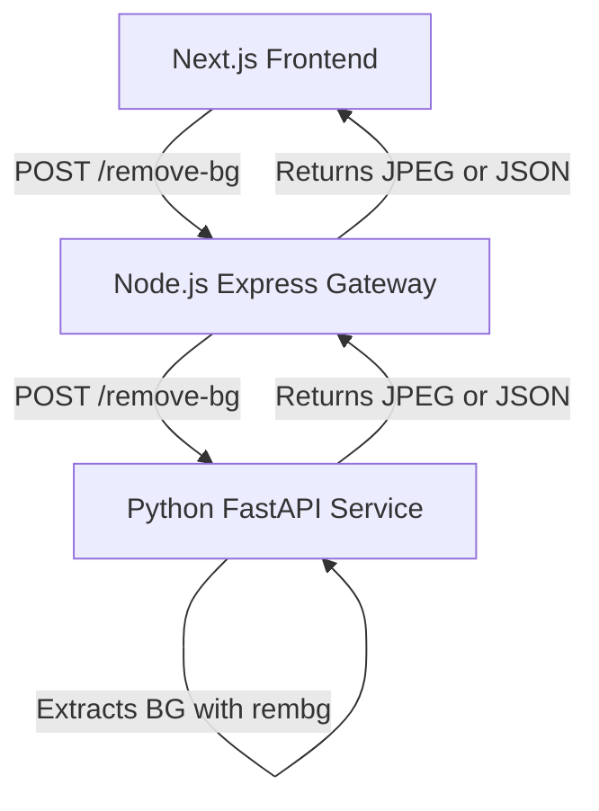

# 🚀 Deploying your Background Remover Server on Render

This guide walks you through deploying your **Bg-server** multi-service backend to [Render](https://render.com/). 

Your project consists of two distinct components that work together:
1. **Python Service (`python-bg-remover`)**: Handles the AI-heavy background removal using `rembg`, Pillow, and OpenCV.
2. **Node.js/Express Service (`server`)**: The public gateway that accepts user image uploads, forwards them to the Python service, and handles routing.

We will deploy these as **two separate services** on Render using the exact same GitHub repository.

---

## 📐 Architecture Diagram



---

## 🛠️ Prep Work Completed Automatically
To ensure a flawless deployment, the following optimizations have already been applied, committed, and pushed to your remote repository [picckie-backend](https://github.com/mausam-madquick/picckie-backend.git):

1. **Configurable Endpoints**: Replaced hardcoded `localhost:8000` URLs in `server/Routes/imageRoutes.js` with `process.env.PYTHON_SERVICE_URL` to allow dynamic linking.
2. **Environment Loading**: Added `dotenv/config` in `server/server.js` to support local and production environment configs.
3. **Headless OpenCV Fix**: Replaced `opencv-python` with `opencv-python-headless` in `python-bg-remover/requirements.txt` to avoid startup errors regarding missing X11 graphical libraries in headless Linux environments like Render.
4. **Clean Dependencies**: Removed the unused and problematic `"imagify": "file:.."` dependency from `server/package.json` to prevent build pipeline crashes.

---

## ⚡ Step 1: Deploy the Python Background Remover Service

This service performs the background removal. Since the Express server depends on it, deploy this one **first**.

1. Go to your [Render Dashboard](https://dashboard.render.com/) and click **New +** -> **Web Service**.
2. Connect your GitHub repository: `https://github.com/mausam-madquick/picckie-backend.git`.
3. Configure the Web Service using the following settings:

| Setting Name | Value |
| :--- | :--- |
| **Name** | `picckie-bg-remover` *(or any name you prefer)* |
| **Language / Runtime** | `Python 3` |
| **Branch** | `main` |
| **Root Directory** | `python-bg-remover` |
| **Build Command** | `pip install -r requirements.txt` |
| **Start Command** | `uvicorn app:app --host 0.0.0.0 --port $PORT` |
| **Instance Type** | `Free` *(or Starter if you want faster performance)* |

4. Click **Deploy Web Service** and wait for it to build.
5. 📝 **Note the URL**: Once successfully deployed, copy the generated service URL at the top of the page (it will look like `https://picckie-bg-remover.onrender.com`).

> [!IMPORTANT]
> **u2net.onnx Model Download**: The first time you make an API call to this Python service, `rembg` will download the 176MB `u2net.onnx` model from the internet. On Render's Free tier, this might take 1–2 minutes and cause the first request to load slowly or timeout. Subsequent requests will be extremely fast.

---

## 🟢 Step 2: Deploy the Express Gateway Server

This service connects your frontend application to the background remover service.

1. In your Render Dashboard, click **New +** -> **Web Service**.
2. Connect the same GitHub repository: `https://github.com/mausam-madquick/picckie-backend.git`.
3. Configure the Web Service using the following settings:

| Setting Name | Value |
| :--- | :--- |
| **Name** | `picckie-backend` |
| **Language / Runtime** | `Node` |
| **Branch** | `main` |
| **Root Directory** | `server` |
| **Build Command** | `npm install` |
| **Start Command** | `npm start` |
| **Instance Type** | `Free` |

4. Scroll down and click **Advanced** to add **Environment Variables**:

| Key | Value | Description |
| :--- | :--- | :--- |
| `PYTHON_SERVICE_URL` | `https://picckie-bg-remover.onrender.com` | **The exact URL of your Python service from Step 1** |
| `PORT` | `8001` | The default port for your Express gateway |

5. Click **Deploy Web Service** and wait for the build to finish.
6. 📝 **Note the URL**: Copy your Express Gateway URL (e.g., `https://picckie-backend.onrender.com`).

---

## 🎨 Step 3: Connect your Next.js Frontend (`picckie`)

To connect your frontend web application (`picckie`) to your newly deployed background remover backend:

1. Open your frontend code in your workspace.
2. Open the **`.env`** or **`.env.local`** file inside `picckie/.env`.
3. Update your backend API endpoint to point to your deployed Express Gateway:
   ```env
   NEXT_PUBLIC_BACKEND_URL=https://picckie-backend.onrender.com
   ```
4. Save and redeploy your frontend web application!

---

## 💡 Essential Render Pro-Tips

> [!TIP]
> **Render Free Tier Cold Starts**: Render puts Free tier services to sleep after 15 minutes of inactivity. When a new request comes in, it will take 50 seconds to spin back up. If you notice a delay, it is simply the container waking up!
> 
> **Increasing Timeouts**: Because image processing can take several seconds (especially with multi-border and sticker overlays), ensure your frontend Axios or Fetch requests do not have a timeout shorter than 30 seconds.
