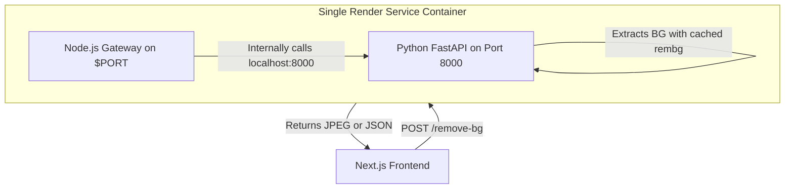

# 🚀 Deploying your Background Remover Server on Render

Yes! You can absolutely deploy both the **Node.js Express Server** and the **Python Background Remover** together in **one single place** (a single Web Service on Render). 

This is highly recommended because:
* **Cost Effective**: You only run **one** Render service instead of two.
* **No Network Lag**: Communication between Node and Python happens internally inside the same container.
* **Instant Model Loading**: The 176MB `u2net.onnx` AI model is pre-downloaded *during* the Docker build, completely eliminating the 1-2 minute request timeout on the first image processing call.

We achieve this by packaging both runtimes together inside a single **Docker Container**.

---

## 📐 Unified Architecture



---

## 🛠️ Unified Files Added to GitHub
The files required to build this unified environment have already been created, committed, and pushed to your remote repository [picckie-backend](https://github.com/mausam-madquick/picckie-backend.git):

1. **`Dockerfile`**: Builds a lightweight environment featuring both **Node.js 20** and **Python 3.10**, and pre-downloads the AI model so it's ready on startup.
2. **`start.sh`**: A shell script that starts the Python server in the background and runs the Express server in the foreground.

---

## ⚡ Option A: Deploy Both Together in ONE Place (Recommended)

To deploy both services inside a single Render service:

1. Log into your [Render Dashboard](https://dashboard.render.com/) and click **New +** -> **Web Service**.
2. Connect your GitHub repository: `https://github.com/mausam-madquick/picckie-backend.git`.
3. Configure the Web Service using the following settings:

| Setting Name | Value |
| :--- | :--- |
| **Name** | `picckie-backend-unified` |
| **Language / Runtime** | **`Docker`** *(Render will automatically select this if it sees the Dockerfile)* |
| **Branch** | `main` |
| **Root Directory** | *(Leave completely empty/blank to use the repo root)* |
| **Instance Type** | `Free` *(or higher)* |

4. Click **Deploy Web Service** and wait for it to build.
   * *Note: The build will take 3-5 minutes because Docker is pre-downloading and caching the 176MB `u2net.onnx` background-removal model inside the image. Once built, it will be lightning-fast to boot up!*
5. 📝 **Note the URL**: Once deployed, copy your unified service URL (e.g., `https://picckie-backend-unified.onrender.com`).

---

## 🟢 Option B: Deploy Them Separately (Two Places)

If you prefer to deploy them as two separate native services instead of Docker, follow these steps:

### 1. Deploy the Python Background Remover Service
* **Name**: `picckie-bg-remover`
* **Runtime**: `Python 3`
* **Root Directory**: `python-bg-remover`
* **Build Command**: `pip install -r requirements.txt`
* **Start Command**: `uvicorn app:app --host 0.0.0.0 --port $PORT`
* *Note down the generated URL (e.g., `https://picckie-bg-remover.onrender.com`)*.

### 2. Deploy the Express Gateway Server
* **Name**: `picckie-backend`
* **Runtime**: `Node`
* **Root Directory**: `server`
* **Build Command**: `npm install`
* **Start Command**: `npm start`
* **Environment Variables**:
  * `PYTHON_SERVICE_URL`: `https://picckie-bg-remover.onrender.com` *(from step 1)*
  * `PORT`: `8001`

---

## 🎨 Connecting your Next.js Frontend (`picckie`)

To connect your frontend web application (`picckie`) to your newly deployed backend:

1. Open your frontend code folder.
2. Open the **`.env`** or **`.env.local`** file inside `picckie/.env`.
3. Update the URL to point to your deployed Render URL:
   ```env
   # If you used the recommended Option A (Single Place):
   NEXT_PUBLIC_BACKEND_URL=https://picckie-backend-unified.onrender.com
   
   # If you used Option B (Two Places):
   NEXT_PUBLIC_BACKEND_URL=https://picckie-backend.onrender.com
   ```
4. Save and redeploy your frontend web application!

---

## 💡 Essential Render Pro-Tips

> [!TIP]
> **Free Tier Cold Starts**: Render puts Free tier services to sleep after 15 minutes of inactivity. When a new request comes in, it will take ~50 seconds to spin back up. If you notice a delay, it is simply the container waking up!
> 
> **Increasing Timeouts**: Because image processing can take several seconds (especially with multi-border and sticker overlays), ensure your frontend Axios or Fetch requests do not have a timeout shorter than 30 seconds.
